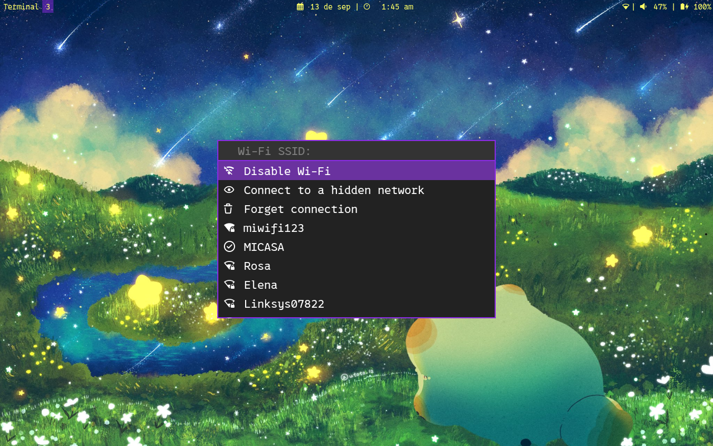
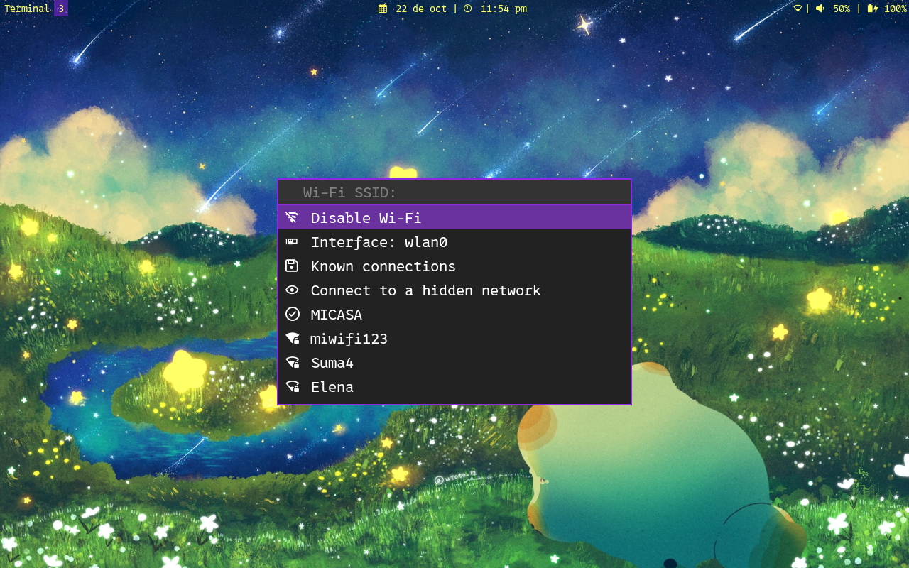
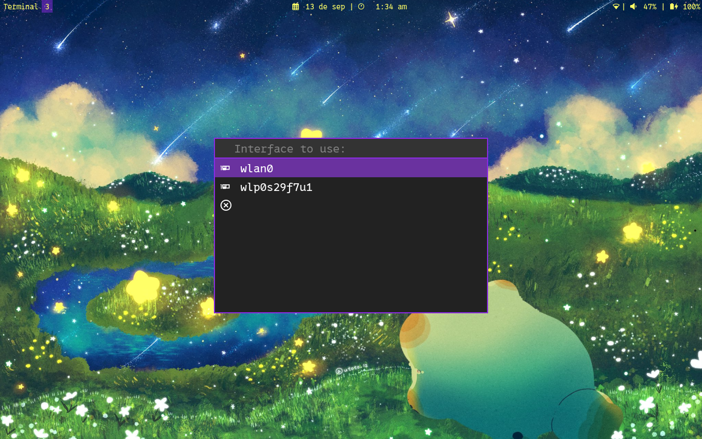
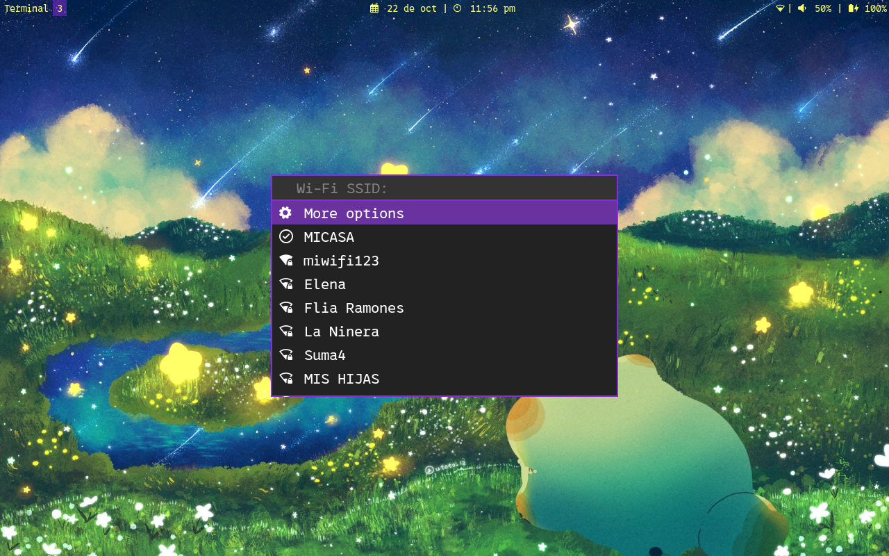

# wifimenu

A Bash script to connect to a Wi-Fi network using NetworkManager and a launcher.

Launcher style in the screenshots above is not include.

## Features

- Enable/Disable Wi-Fi device
- Select the Wi-Fi interface to use
- Connect to a hidden Wi-Fi network
- Forget known connections
- Disconnect from the current connected Wi-Fi network
- Shows if Wi-Fi network is secure via WPA 1/2
- Shows signal level visually
- A submenu to contain all of the above options
- Translate to your language by modifying script variables
- Can be use with your preferred launcher:
	- wofi
	- rofi
	- wmenu
	- dmenu
	- bemenu

## Considerations

- Does not show WEP Wi-Fi networks, and probably never will
- Does not notify about the result of the connection operation, and maybe I will add the option in the future
- When using this script with dmenu launcher, the botton for hide passwords does not work

## Dependencies

- Bash (but I'm not sure, or am I?)
- NetworkManager
- At least one of the following launchers: wofi, rofi, wmenu, dmenu, bemenu
- It uses heavily Nerd Fonts characters. [Download a font](https://www.nerdfonts.com/) or change the characters at your own risk

## Translation

The following variables can be changed in the script to translate the menu text:
	tr\_scanning\_networks="Scanning networks"
	tr\_scanning\_networks\_complete="Scanning completed"
	tr\_submenu\_message="More options"
	tr\_submenu\_close\_message="Close options"
	tr\_disable\_message="Disable Wi-Fi"
	tr\_enable\_message="Enable Wi-Fi"
	tr\_hidden\_message="Connect to a hidden network"
	tr\_forget\_message="Forget connection"
	tr\_interface\_message="Interface:"
	tr\_main\_menu\_prompt="Wi-Fi SSID:"
	tr\_select\_interface\_prompt="Interface to use:"
	tr\_connect\_hidden\_prompt="Network name:"
	tr\_ask\_password\_prompt="Password:"
	tr\_forget\_connection\_prompt="Connection to forget:"
	tr\_forget\_connection\_sure\_prompt\_1="Forget"
	tr\_forget\_connection\_sure\_prompt\_2="?"

## Predecessor

I previously wrote a simpler Bash script that I consider the predecessor of this one, although I called it wofi-wifi-menu. For that reason this script starts from version 2, although the name has changed.

At first, when I thought about writing wofi-wifi-menu, I took inspiration from [this script](https://github.com/ericmurphyxyz/rofi-wifi-menu), but in the end I ended up rewriting it completely.

This is a list of similar scripts that I found at the moment of rewrite this README for version 2, since I don't know who is the original autor:
- <https://github.com/Macr0Nerd/wofi-wifi-menu?tab=readme-ov-file>
- <https://github.com/zbaylin/rofi-wifi-menu>

However, this script is completely done by me and the above inspiration was only from the concept (and the previous name, I guess).

## License

wifimenu is free software: you can redistribute it and/or modify it under the terms of the GNU General Public License as published by the Free Software Foundation, either version 3 of the License, or (at your option) any later version.

wifimenu is distributed in the hope that it will be useful, but WITHOUT ANY WARRANTY; without even the implied warranty of MERCHANTABILITY or FITNESS FOR A PARTICULAR PURPOSE. See the GNU General Public License for more details.
 
You should have received a copy of the GNU General Public License along with this program. If not, see <https://www.gnu.org/licenses/>.
