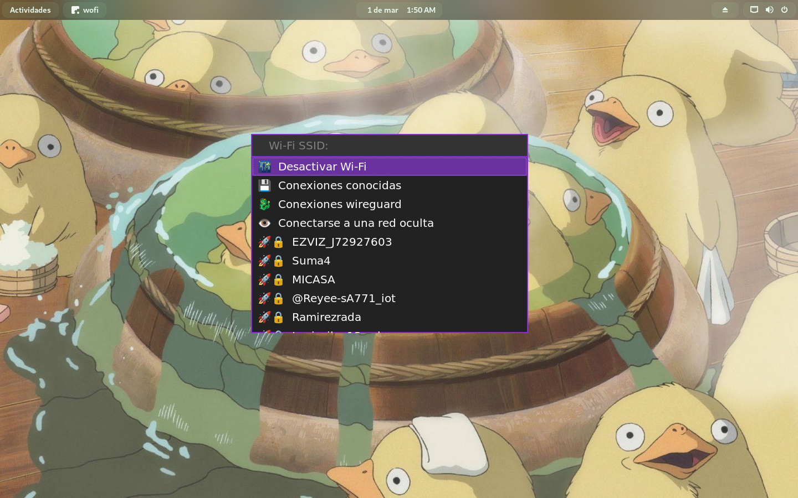

# wifimenu

A Bash script to connect to a Wi-Fi network using NetworkManager and a launcher.




Launcher style in the screenshots above is not include.

## Features

- Enable/Disable Wi-Fi device
- Select the Wi-Fi interface to use
- Connection options: forget, DNS, static IP...
- Wireguard support
- Connect to a hidden Wi-Fi network
- Disconnect from the current connected Wi-Fi network
- Shows if Wi-Fi network is secure via WPA 1/2
- Shows signal level visually
- A submenu to contain all of the above options
- Desktop notifications via notify-send
- Translate to your language by modifying script variables in a configuration file
- Can be use with your preferred launcher:
	- wofi
	- rofi
	- wmenu
	- dmenu
	- bemenu
	- Or a custom one!

## Considerations

- Does not show Wi-Fi networks with WEP security
- When using this script with dmenu launcher, the botton to hide passwords does not work

## Dependencies

### Required

- Bash (wifimenu was developed for Bash 5. I don't know if it works on previous versions or with other shells)
- NetworkManager
- A menu launcher
- A [Nerd Fonts](https://www.nerdfonts.com/) font or a font that support emojis

### Optional

- libnotify (optional)

## Translation and customization

### Configuration file location

The following files are sourced in the corresponding order. If one of the files is found, the following files will not be searched:

1. \$XDG\_CONFIG\_HOME/\$program\_name/config
2. \$HOME/.config/\$program\_name/config
3. \$HOME/.\$program\_name

The variable `program_name` is set to `basename $0`.

Any modification of the program can be made in the configuration file to avoid losing modifications when updating the script.
Command line options overwrite this file.

### Variables for configuration file

Some variables of interest may be:

- **launcher**: A string defining the launcher (default is 'wofi'). The possible values are:
	- wofi
	- rofi
	- wmenu
	- dmenu
	- bemenu
	- custom
- **custom_opts**: It's an asosiative array with 4 values that must be set when `launcher` variable is set to 'custom'.
	- **custom_opts[launcher]**: Launcher command or path.
	- **custom_opts[insensitive]**: Launcher options for case-insensitive input.
	- **custom_opts[sensitive]**: Launcer options for case-sensitive input.
	- **custom_opts[password]**: Launcher options for password-prompt mode.
- **submenu**: If set, shows Wi-Fi options in a submenu (unset by default).
- **emoji**: If set, shows emoji icons instead of Nerd Fonts icons.
- **wireguard**: If set, shows wireguard connections option in the main manu (unset by default).
- **notifications**: If set, sends desktop notifications (if notify-send can be found by the user's PATH, then it is set).

That a variable is set means that it has a value assigned to it (any value). For example:

```sh
launcher='rofi'    # It's set
submenu=1          # It's set
wireguard=         # It's not set
```

### Custom launcher syntax

The custom launcher options must be given with the corresponding dashes.

```sh
# In config file
custom_opts[launcher]='wofi'
custom_opts[insensitive]='--dmenu --insensitive --prompt'
custom_opts[sensitive]='-d -p'
custom_opts[password]='--dmenu --password -p'

# or

# In command line
wifimenu --custom wofi '--dmenu --insensitive --prompt' '-d -p' '-d --password --prompt'
```

Note that the last flag must be the one to set the prompt.

If your launcher don't support password prompt, just set it case-sensitive.

### Icons

By default Nerd Fonts icons are use. If you don't want to use a Nerd Fonts font, emojis can be use for icons.

```sh
# In config file
emoji=1

# or

# In command line
wifimenu --emoji
```

Each icon can be customized in the configuration file setting the following variables:

```sh
icon_dragon=
icon_config=
icon_close=
icon_check=
icon_eye=
icon_eye_closed=
icon_saved=
icon_automatic=
icon_wifi_enable=
icon_wifi_disable=
icon_wifi_1=
icon_wifi_2=
icon_wifi_3=
icon_wifi_4=
icon_wifi_5=
icon_wifi_6=
icon_interface=
icon_4_1=
icon_4_2=
icon_6_1=
icon_6_2=
icon_plug=
icon_trash=
icon_pen=
icon_wireless=
icon_net_1=
icon_net_2=
icon_net_3=
icon_net_4=
icon_net_5=
icon_unlock=
icon_on=
icon_off=
```

Which icon does each variable belong to? Find out on your own, to much documentation.

If you customize the icons, it's better to set just one character (UTF-8 is fine) for each one,
as it could have unexpected behavior otherwise, or not, it is just not tested.

### Translation

The following variables can be changed in the the configuration file to translate the text:

```sh
tr_scanning_networks='Scanning networks'
tr_scanning_networks_complete='Scanning completed'
tr_submenu_message='More options'
tr_disable_message='Disable Wi-Fi'
tr_enable_message='Enable Wi-Fi'
tr_interface_message='Interface:'
tr_known_connections_message='Known connections'
tr_autoconnect_message='Autoconnect'
tr_ipv4_config_message='DHCP configuration'
tr_dns4_message='DNS IPv4'
tr_ipv6_config_message='IPv6 configuration'
tr_dns6_message='DNS IPv6'
tr_autoip_message='Automatic IP configuration'
tr_autodns_message='Automatic DNS'
tr_address_message='Addresses'
tr_gateway_message='Gateway:'
tr_forget_message='Forget connection'
tr_wireguard_message='Wireguard connections'
tr_wireguard_enable_message='Enable VPN'
tr_rename_connection_message='Rename connection'
tr_hidden_message='Connect to a hidden network'

tr_main_menu_prompt='Wi-Fi SSID:'
tr_select_interface_prompt='Interface to use:'
tr_ask_password_prompt='Password:'
tr_menu_dns_prompt='New DNS:'
tr_menu_dns_sure_prompt_1='Remove DNS'
tr_menu_dns_sure_prompt_2='?'
tr_menu_ip_config_addresses_prompt='address1/CIDR_mask,address2/CIDR_mask,...'
tr_menu_ip_config_gateway_prompt='New gateway:'
tr_menu_addresses_prompt='New address:'
tr_menu_addresses_sure_prompt_1='Remove address'
tr_menu_addresses_sure_prompt_2='?'
tr_forget_connection_prompt='Connection to forget:'
tr_forget_connection_sure_prompt_1='Forget'
tr_forget_connection_sure_prompt_2='?'
tr_rename_connection_prompt='New name:'
tr_connect_hidden_prompt='Network name:'

tr_notice_connected_summary='Connected to network'
tr_notice_disconnected_summary='Disconnected from network'
tr_notice_error_summary='Connection error'
tr_notice_enable_wifi_summary='Wi-Fi enabled'
tr_notice_disable_wifi_summary='Wi-Fi disabled'
tr_notice_connected_wifi_body='Successful connection to Wi-Fi network'
tr_notice_disconnected_wifi_body='Successful disconnection from Wi-Fi network'
tr_notice_error_wifi_connection_body='An error occurred while trying to connect to the Wi-Fi network'
tr_notice_error_wifi_disconnection_body='An error occurred while trying to disconnect to the Wi-Fi network'
tr_notice_connected_vpn_body='Successful connection to VPN'
tr_notice_disconnected_vpn_body='Successful disconnection from VPN'
tr_notice_error_vpn_connection_body='An error occurred while trying to connect to the VPN'
tr_notice_error_vpn_disconnection_body='An error occurred while trying to disconnect to the VPN'
tr_notice_enable_wifi_body='Wi-Fi was successfully enabled'
tr_notice_disable_wifi_body='Wi-Fi was successfully disabled'
```

## Wireguard support

The wireguard connection must already exist. To import a wireguard profile FILE.conf:
```sh
sudo nmcli connection import type wireguard file /PATH/TO/FILE.conf
```
Replace `/PATH/TO/FILE.conf` with the actual path of your *.conf* wireguard file.

To learn more about wireguard configuration in NetworkManager, see: <https://blogs.gnome.org/thaller/2019/03/15/wireguard-in-networkmanager/>

## Donations

Monero:
```txt
8C7q6JRYpehXAWotiHhrnQ4PuVKnAJZSVQ1pTM8xXXRtUdS9ofAyrLy6chP5SvmKDN2LWvESLME8W897vdQGf4rM4DQchhw
```
PayPal:
```txt
podopodadobu@gmail.com
```

## License

wifimenu is free software: you can redistribute it and/or modify it under the terms of the GNU General Public License as published by the Free Software Foundation, either version 3 of the License, or (at your option) any later version.

wifimenu is distributed in the hope that it will be useful, but WITHOUT ANY WARRANTY; without even the implied warranty of MERCHANTABILITY or FITNESS FOR A PARTICULAR PURPOSE. See the GNU General Public License for more details.
 
You should have received a copy of the GNU General Public License along with this program. If not, see <https://www.gnu.org/licenses/>.
